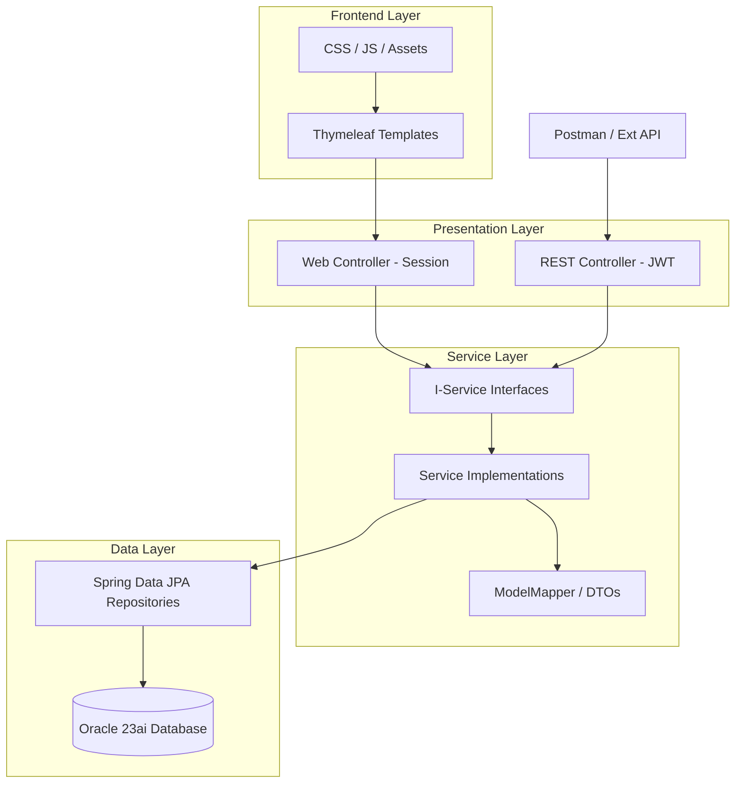

# Application Architecture

RevPay follows a modern, monolithic **N-Tier Architecture** pattern.

## Layers Overview

### 1. Presentation Layer
- **Web Controllers:** Manage server-side rendering with Thymeleaf. Secured via HTTP Sessions.
- **REST Controllers:** Manage API interactions for mobile/third-party integration. Secured via JWT tokens.

### 2. Service Layer (Business Logic)
- This layer contains the core financial logic (e.g., calculating interest, validating wallet balances).
- It is decoupled from the UI/API layers via **Interfaces** (prefix: `I`).
- **DTOs (Data Transfer Objects):** Ensure that internal entity details (like password hashes) never reach the client.

### 3. Data Layer (Persistence)
- Uses **Spring Data JPA** with **Hibernate** for ORM mapping.
- Connected to an **Oracle 23ai** database for enterprise-grade data management.
- Transactional integrity is maintained using `@Transactional` at the service level.
