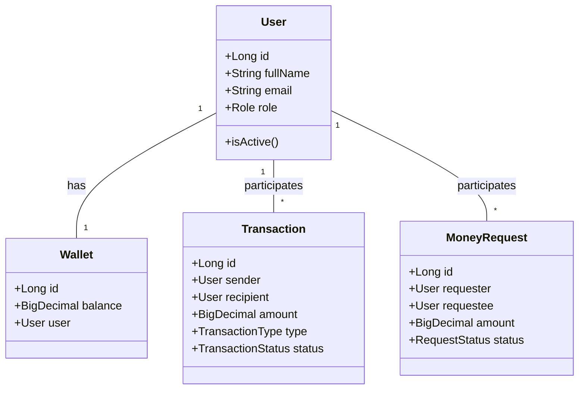
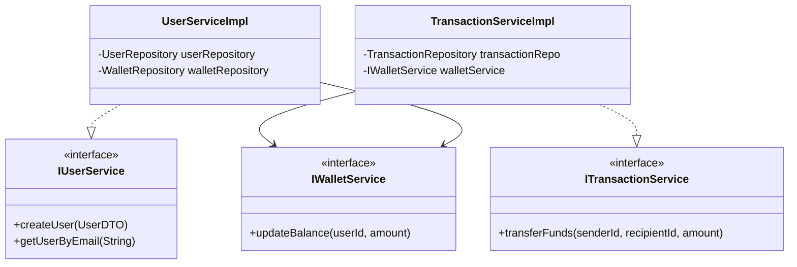
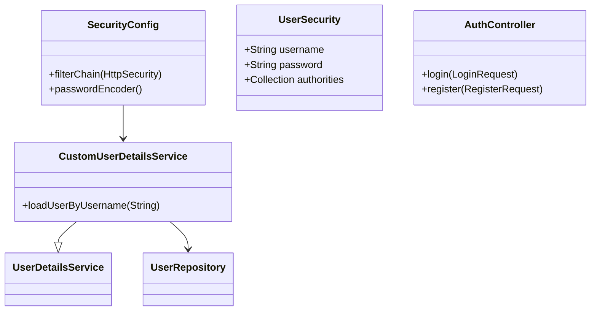

# Class Diagrams

## 1. Core Entities and Relationships
This diagram shows the domain model and how entities interact.

## 2. Service Layer Architecture
This diagram outlines the service interfaces and their implementations.

## 3. Security and Authentication Flow
This diagram illustrates the security components.

