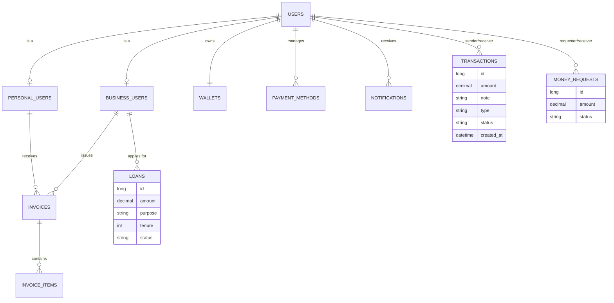

# Entity Relationship Diagram (ERD)

The following diagram illustrates the relational database schema for RevPay, mapped using JPA/Hibernate.

## Core Tables
1.  **USERS (users):** Base authentication table (Email, Password, Role).
2.  **PERSONAL_USERS (personal_users):** Extended profile for individuals.
3.  **BUSINESS_USERS (business_users):** Extended profile for companies (Tax ID, Business Type).
4.  **WALLETS (wallets):** Holds user balances.
5.  **TRANSACTIONS (transactions):** Central ledger for all money movements.
6.  **INVOICES (invoices):** B2C billing records.
7.  **LOANS (loans):** Small business credit applications.
8.  **PAYMENT_METHODS (payment_methods):** Tokenized card information.
9.  **NOTIFICATIONS (notifications):** User alert history.
