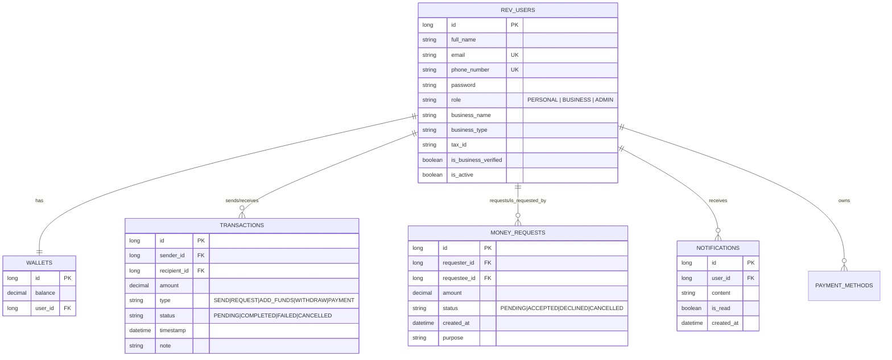

# Entity Relationship Diagram (ERD)

The following diagram illustrates the database structure and relationships between core entities in RevPay.

```mermaid
erDiagram
    REV_USERS ||--|| WALLETS : "has"
    REV_USERS ||--o{ TRANSACTIONS : "sends/receives"
    REV_USERS ||--o{ MONEY_REQUESTS : "requests/is_requested_by"
    REV_USERS ||--o{ NOTIFICATIONS : "receives"
    REV_USERS ||--o{ PAYMENT_METHODS : "owns"
    
    REV_USERS {
        long id PK
        string full_name
        string email UK
        string phone_number UK
        string password
        string role "PERSONAL | BUSINESS | ADMIN"
        string business_name
        string business_type
        string tax_id
        boolean is_business_verified
        boolean is_active
    }

    WALLETS {
        long id PK
        decimal balance
        long user_id FK
    }

    TRANSACTIONS {
        long id PK
        long sender_id FK
        long recipient_id FK
        decimal amount
        string type "SEND|REQUEST|ADD_FUNDS|WITHDRAW|PAYMENT"
        string status "PENDING|COMPLETED|FAILED|CANCELLED"
        datetime timestamp
        string note
    }

    MONEY_REQUESTS {
        long id PK
        long requester_id FK
        long requestee_id FK
        decimal amount
        string status "PENDING|ACCEPTED|DECLINED|CANCELLED"
        datetime created_at
        string purpose
    }

    NOTIFICATIONS {
        long id PK
        long user_id FK
        string content
        boolean is_read
        datetime created_at
    }
```
