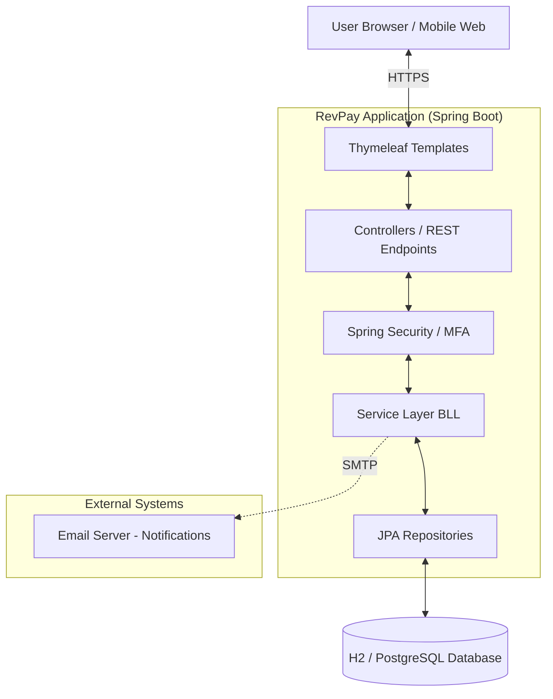

# System Diagram

This diagram shows the high-level architecture of the RevPay system and how components interact.

```mermaid
graph TD
    Client[User Browser / Mobile Web]
    
    subgraph "RevPay Application (Spring Boot)"
        UI[Thymeleaf Templates]
        Controller[Controllers / REST Endpoints]
        Security[Spring Security / MFA]
        Service[Service Layer BLL]
        Repo[JPA Repositories]
    end
    
    DB[(H2 / PostgreSQL Database)]
    
    Client <-->|HTTPS| UI
    UI <--> Controller
    Controller <--> Security
    Security <--> Service
    Service <--> Repo
    Repo <--> DB
    
    subgraph "External Systems"
        Mail[Email Server - Notifications]
    end
    
    Service -.->|SMTP| Mail
```
