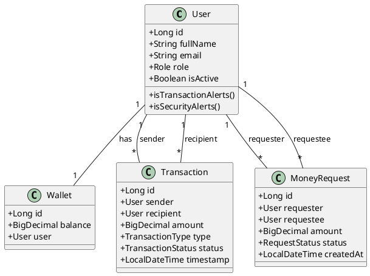
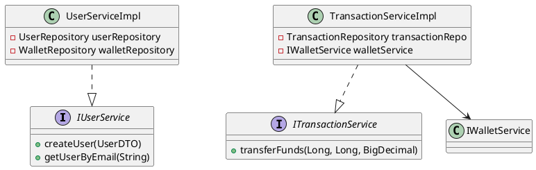
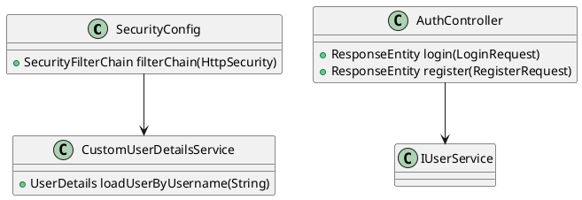

# Class Diagrams (PlantUML)

Copy and paste the blocks below into a PlantUML editor (e.g., [planttext.com](https://www.planttext.com)).

## 1. Core Entities

## 2. Service Layer

## 3. Security Flow

