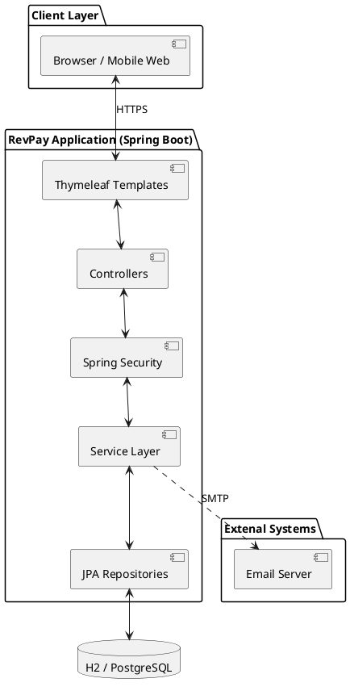

# System Diagram (PlantUML)

```plantuml
@startuml
package "Client Layer" {
    [Browser / Mobile Web] as client
}

package "RevPay Application (Spring Boot)" {
    [Thymeleaf Templates] as ui
    [Controllers] as ctrl
    [Spring Security] as sec
    [Service Layer] as svc
    [JPA Repositories] as repo
}

database "H2 / PostgreSQL" as db

package "Extenal Systems" {
    [Email Server] as mail
}

client <--> ui : HTTPS
ui <--> ctrl
ctrl <--> sec
sec <--> svc
svc <--> repo
repo <--> db
svc ..> mail : SMTP
@enduml
```
